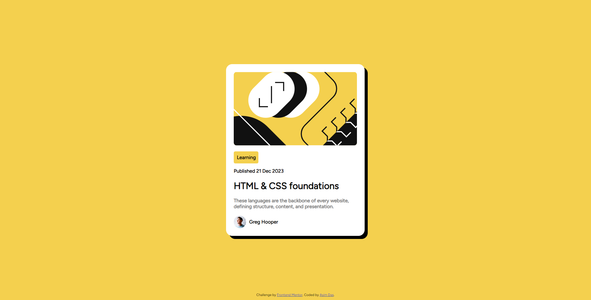

# Frontend Mentor - Blog preview card solution

This is a solution to the [Blog preview card challenge on Frontend Mentor](https://www.frontendmentor.io/challenges/blog-preview-card-ckPaj01IcS). Frontend Mentor challenges help you improve your coding skills by building realistic projects. 

## Table of contents

- [Overview](#overview)
  - [The challenge](#the-challenge)
  - [Screenshot](#screenshot)
  - [Links](#links)
- [Built with](#built-with)
- [Author](#author)

**Note: Delete this note and update the table of contents based on what sections you keep.**

## Overview

### The challenge

Users should be able to:

- See hover and focus states for all interactive elements on the page

### Screenshot

### Links

- Solution URL: [Link](https://github.com/Asimcoded/blog-preview-card-frontend_mentor)
- Live Site URL: [Link](https://asimcoded.github.io/blog-preview-card-frontend_mentor/)

## Built with

- Semantic HTML5 markup
- CSS custom properties
- Flexbox
- Mobile-first workflow

## Author

- Github - [Asimcoded](https://github.com/Asimcoded)
- Frontend Mentor - [@Asimcoded](https://www.frontendmentor.io/profile/Asimcoded)
- LinkedIn - [@Asim das](https://www.linkedin.com/in/dasasim/)

